# PlayVault — Project Proposal

**Browser Game Hub — Board, Puzzle and Arcade**

30 September 2026 · Kaon · Revision 3

*A formatted edition of this proposal, with a cover page, contents and figures, sits beside it as [PlayVault-Project-Proposal.docx](PlayVault-Project-Proposal.docx) and [PlayVault-Project-Proposal.pdf](PlayVault-Project-Proposal.pdf). This Markdown file is the source; the two are generated from it by the scripts in [proposal/](proposal/).*

## Executive summary

PlayVault is a browser game hub: sixteen games in three families — board, puzzle and arcade — behind one lobby, one profile and one save, with no account, no server, no advert and nothing to install. A working build is live at [kaonhew02.github.io/PlayVault](https://kaonhew02.github.io/PlayVault/): four board games against the computer or a second player, three puzzles — every Sudoku with exactly one answer, every Mahjong board clearable — and nine arcade games that run from a two-minute Snake to a first-person shooter with seven modes and a cooking game with 680 levels. Every one of them can be played with friends from a six-digit room code, browser to browser, in English or 简体中文.

It is 45,014 lines of hand-written JavaScript in 125 files and one stylesheet, with no npm package, no framework and no game engine — the three 3D games draw with raw WebGL. On 30 September 2026 the test suite ran 2,555,922 checks with no failure, on the source and again on that source minified the way the build minifies it, and a real Chrome driving the shipped bundle played all sixteen games and confirmed that nothing typed into the console can reach a save.

The product exists because casual games on the web come with a bill — adverts, trackers, sign-ups, energy timers and progress kept on somebody else's server — and a hub of honest, well-made games that runs from a static folder costs almost nothing to offer without any of it.

|  |  |
| --- | --- |
| Product | PlayVault — *One Hub. Endless Games.* |
| Category | Browser game hub — board, puzzle and arcade games |
| Primary player | Casual players on a laptop or phone browser, in English or 简体中文 — starting with friends and family in Malaysia |
| Delivered | 16 of 16 games on the roster, all playable alone or with friends; nothing is a stub |
| Stack | Static site on GitHub Pages · Canvas 2D and raw WebGL · `localStorage` · WebRTC rooms · optional Google Drive copy |
| Security | The lock (`guard.js`) · sealed saves and backups · strict Content-Security-Policy · SRI on the one third-party library |
| Dependencies | No npm packages, no framework, no game engine; two outside scripts — PeerJS, fetched with the page but used only for rooms, and Google's sign-in client, fetched only when Drive is about to be used |
| Running cost | RM 0 a month — hosting, rooms and the Drive copy all run on free tiers or the player's own storage |
| Effort to date | 49 commits on nine working days, 7–30 September 2026 |
| Proposed next phase | 12 weeks: friends who connect from any network, Drive for everyone, an address of its own, a seventeenth game, sound, touch and contrast, and a verified v1.0 |

**The ask.** Approval to run the twelve-week Phase 4 in [Project plan and timeline](#project-plan-and-timeline) at the resourcing set out in [Resources and budget](#resources-and-budget) — one developer, part-time, about 120 hours, with RM 0 committed and any spend (at most about RM 230 in the first year) gated behind a written decision.

## Background and problem statement

The problem is not a shortage of free games on the web. It is what the free ones charge instead of money.

A portal of casual games is paid for by adverts — a video before the game, another between levels, a third to "continue" after dying — and by the trackers that price those adverts. Progress lives per game and per site, and usually disappears with the browser's cookies unless the player makes an account. App-store versions of the same games add an install, notifications and in-app purchases, and an energy timer turns a five-minute game into a daily appointment. A school or office laptop often cannot install anything at all.

Playing *with* somebody is worse. Most multiplayer casual games need every player on the same account system or the same app, and a server somewhere to hold the match. Two friends at a table with two phones and ten minutes rarely get that far.

PlayVault began on 7 September 2026 with a roster of eleven games and one question: how much of that is actually necessary? Three weeks and sixteen games later, the answer is almost none of it.

### What the alternatives cost the player

| Option | What it costs the player |
| --- | --- |
| Advert-funded web portals | A video before play and another between rounds; trackers and consent banners; progress kept only while the cookies last |
| App-store casual games | An install, permissions and notifications; in-app purchases, energy timers and "watch an advert to continue" |
| One app per game | A separate install, account and set of adverts for 象棋, for Sudoku, for Mahjong — and nothing that carries between them |
| PC and console launchers | A download measured in gigabytes and an account, for games meant to fill ten minutes |
| Multiplayer services | Everybody on one account system, and a server that holds the match and can switch it off |

### The gap for this audience

PlayVault's first players are friends and family in Malaysia, where a great many casual players read 简体中文 as readily as English, and where the games people already know are 象棋, 五子棋 and 麻将 as much as Tetris and Snake. A hub that is Chinese throughout — the menus, the options, the rules and the end-of-game card, not only the game names — and that treats Chinese Chess as seriously as Chess is not what a Western portal ships.

### The design flaw underneath most hubs

A hub of unrelated games usually shares nothing: every game carries its own save format, its own settings and its own idea of what "game over" looks like, and multiplayer — if there is any — is built again for each one. The opposite mistake is just as expensive: force every game into one engine contract and every game spends its life fighting the shell. PlayVault's sister hub CardVerse gets away with one contract because every card game is seats, turns and bets; a roster that runs from Chess to a first-person shooter does not fit one.

PlayVault's founding constraint is the middle path, and everything else follows from it: **three families, three contracts, and a new game changes no screen — it lives in its own folder, and outside it is only listed.**

## Proposed solution

PlayVault is one static web page that holds sixteen games. It keeps every save in the player's own browser, sends a copy to the player's own Google Drive only when asked, and connects friends browser to browser. There is no account to create, no server to trust and nothing to buy.

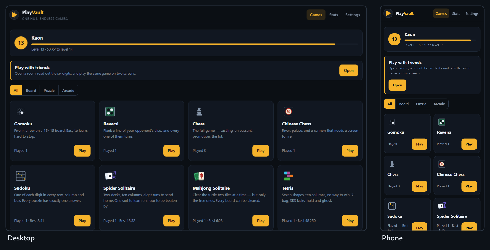

### Three families, three contracts

Every game belongs to one family, chosen by how it uses time, and every family has an engine contract. The board games and every arcade game but Tetris also share a harness: the game supplies its rules and its painting, and the harness supplies the canvas, resizing, full screen, pause, undo, the computer's turn, key repeat, the thumb pad and the end-of-game card. The puzzles and Tetris draw their own bar.

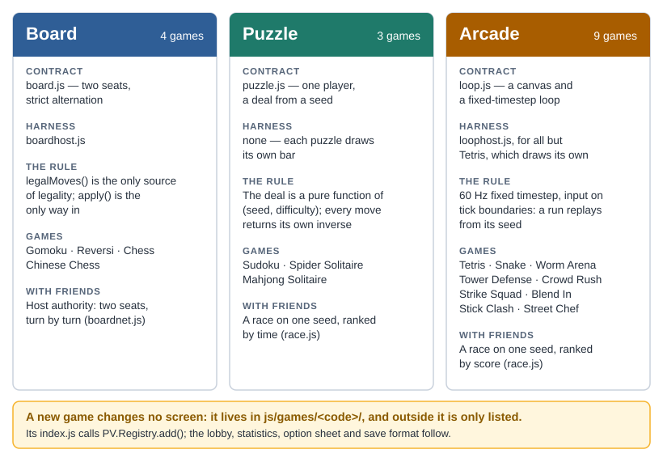

The family also decides how a game is played with friends, which is why online play took two mechanisms rather than sixteen integrations: board games run on host authority, turn by turn, and puzzle and arcade games race a shared seed. See [Playing with friends](#playing-with-friends).

### The rule that keeps a new game cheap

A game is one folder, `js/games/<code>/`, whose `index.js` calls `PV.Registry.add({...})` with its family, its names in both languages, its options and a `start()` function. The lobby card, the option sheet, the statistics row and the save format all follow from that one call. **The shell, `js/app.js`, names no game** — not one game code appears in it — and it must stay that way: the moment a screen special-cases a game, the next game costs twice as much.

Three lists outside the folder still have to name a game, and all three are called out wherever they matter: its script tags in `index.dev.html`, which is where the build reads the script list; its strings, in the two dictionaries in `js/core/i18n.js`; and, for a game that saves progress, its key in `BACKUP_STORES` in `js/core/store.js` — and in the sealed list, if the save holds anything earned.

### Engines that can be trusted

Engines never touch the page, the profile or `Math.random()`. Everything random comes from a seeded `PV.RNG`, and real-time games run on a fixed 60 Hz timestep with input applied on tick boundaries. Three things fall out of that discipline for free:

- **Replays.** The same seed and the same inputs produce the same game, every time — and the test suite checks it for every arcade game.
- **Races without a server.** Friends handed one seed get the same deal, the same map and the same bots, so only their scores need to cross the network.
- **Tests without a browser.** Every engine runs headless in Node, so the suite plays whole matches, careers and tournaments in about half a minute.

### What the player gets that they did not have

- **Nothing between them and the game.** No advert, no account, no install, no consent banner and no energy timer. The page loads and the game starts.
- **One profile across sixteen games.** XP earned in Sudoku shows on the lobby's level bar; best times and scores sit in one statistics table.
- **Friends in under a minute.** One player opens a room and reads out six digits; nobody makes an account.
- **Their own copy of their progress.** Export to a file, or keep a copy in their own Google Drive that nobody else can see.
- **Two languages throughout.** English and 简体中文, from the lobby to the rules to the end-of-game card, switchable at any moment.
- **A computer opponent that plays fair.** Bots use a player's controls and a player's limits and never know what they could not see; difficulty is mostly how sharp their eyes and hands are. The one exception is on purpose: on easy and normal, a Strike Squad bot's hits land on the player at half and at 0.6 strength.

## Objectives and success criteria

The project succeeds if anybody can open PlayVault in a modern browser, play any of its games alone or with a friend on another network, and keep their progress for as long as they like — without an account, an advert or a server. Everything below is a test, not an aspiration.

| # | Objective | Measure | Threshold | Status |
| --- | --- | --- | --- | --- |
| O1 | The whole roster is playable | Games on the roster that play alone and in a room | 16 of 16 | Met |
| O2 | A new game costs only its own folder | Game codes named in the shell, `js/app.js` | 0 | Met |
| O3 | Real-time games replay from their seed | Arcade games with a same-seed, same-inputs check in the suite | 9 of 9 | Met |
| O4 | The rules are right | Chess positions at depths 1–4; Chinese Chess legal opening moves | 20 / 400 / 8,902 / 197,281; exactly 44 | Met — depth 4 in the longer run, `smoke.js 2` |
| O5 | Puzzle deals carry a guarantee | Sudoku puzzles with more than one answer; Mahjong boards that cannot be cleared | 0 and 0 | Met — Spider deals carry none |
| O6 | Difficulty is measured, not guessed | Difficulty or balance changes shipped without a before-and-after measurement | 0 | Met |
| O7 | Nothing to install, anywhere | npm packages, frameworks or game engines needed to run or build it; server-side code | 0 | Met |
| O8 | Playing alone needs no network | Games playable with the network off once the page has loaded | 16 of 16 | Met — by design; no offline first load yet |
| O9 | Friends connect from different networks | A room between mobile data and home broadband that completes a match | Yes | Partial — the code is ready for a relay (29 Sep 2026); the relay needs an account |
| O10 | Progress survives a cleared browser | Export → Import round trip; Drive copy for any Google account | Every store; any account | Partial — Drive open to test users only |
| O11 | A hand-edited save does not count | Edited exports, Drive copies or stored records accepted | 0 | Met |
| O12 | The console cannot reach a save | App functions or storage reachable from the console with the lock on | 0 | Met (29 Sep 2026) |
| O13 | Hostile input cannot run code or hang the app | Crafted backups, stored values or peer messages that execute, crash or hang | 0 | Met |
| O14 | What ships is what was tested | Full suite on minified source; the shipped bundle's hash matching its sources; the shipped bundle played in Chrome | All three | Met |
| O15 | A failed save is never silent | Save writes that fail (full or blocked storage) and are shown to the player | 100% | Met (29 Sep 2026) — a strip over every screen, with Export |
| O16 | Text is readable | WCAG AA contrast on primary text and controls, in both themes | ≥ 4.5:1 | Partial — dark met; light theme's brass buttons 3.79:1 |
| O17 | Two languages, complete | Keys present in English and in 简体中文 | 1,256 of 1,256 | Met |

### What done means for Phase 4

O9, O10 and O16 are the open rows, and with the question of an address of its own they are the whole of the proposed next phase. O9 is an account at a relay provider and two weeks of testing between real networks: the file its credentials go in, the checks on them and a switch to prove the relay are already built. O10 is a consent screen to publish. O16 is one colour token and a re-measure. None of them needs a server, and none of them changes the architecture. O15 was planned for week 3 and is already met: fixed on 29 September, while this proposal was being checked — see [When a save cannot be written](#when-a-save-cannot-be-written). Part of weeks 8–9 has shipped early too: since 30 September the thumb controls appear on every touch screen, tablets included, and Stick Clash has a stick.

### Explicit non-objectives

These are refused on purpose, and each refusal has a reason that should survive a change of mind:

- **No adverts, no purchases, no money.** Coins, gems and XP are earned in play and spent in play; nothing is bought with money and nothing is sold.
- **No accounts.** The Drive copy uses the player's own Google account, and only when the player asks.
- **No global leaderboard.** A score that arrives from a browser is a claim. An honest leaderboard needs a server that re-runs the game, which [Future roadmap](#future-roadmap) prices.
- **No hiding the JavaScript.** Nobody can; what matters is that changing it reaches nothing that belongs to anybody else.
- **No copying a reference game's art, names or code.** Where a game was asked for "like" a commercial one, what was built is the game its store page describes, drawn from scratch under PlayVault's own name.

## Target players and personas

The target player is somebody with ten minutes and a browser — a student between lectures, an office worker at lunch, a grandparent who wants a game of 象棋 without an app full of adverts — and the friends they want to play with. Not a competitive player chasing a ranked ladder, and not somebody looking for a game to spend money in.

| Persona | Situation | What they need | Lives in |
| --- | --- | --- | --- |
| **Jun Hao, 20 — the break-filler** | A university laptop that cannot install anything; ten minutes between lectures | A game that starts in one click, and a best time to beat tomorrow | Sudoku, Tetris, Snake, Mahjong Solitaire |
| **Uncle Lim, 62 — the board player** | Plays 象棋 at the coffee shop; reads Chinese first; finds adverts confusing | Clear pieces, a computer that can be beaten on easy, the whole screen in 简体中文 | Chinese Chess, Gomoku, the language switch |
| **Kaon, 24 — the organiser** | Four friends, four phones, one lunch hour | A room open in seconds, nobody signing up, and a winner every screen agrees on | Play with friends, races |
| **Nurul, 17 — the grinder** | Plays Street Chef and Strike Squad every evening, on a laptop and a phone | Progress that lasts, unlocks worth earning, and a copy that survives a cleared browser | Street Chef, Strike Squad, Blend In, the Drive copy |

One player is usually two of these at once — the organiser is also a grinder — which is why they are one hub and not four apps.

### Jobs to be done

- *When I have ten minutes, I want to be playing within ten seconds, so that the break is spent on the game and not on adverts or sign-ups.*
- *When my friends are round the table, I want us all in the same game in under a minute, so that nobody gives up before it starts.*
- *When I play the computer, I want it to beat me sometimes and lose sometimes, and to feel fair either way.*
- *When I clear my browser or change laptops, I want my level, coins and unlocks back, so that a month of Street Chef is not a month wasted.*
- *When I would rather read Chinese, I want everything in Chinese — the rules and the buttons, not just the titles.*

### Who this is not for

Players who want a ranked ladder, a global leaderboard or cheat-proof tournaments — each needs a server PlayVault deliberately does not have; anybody looking for gambling or prizes; and players who need the hub installed and working with no network at first launch. PlayVault is not yet an installable app, and [Future roadmap](#future-roadmap) says what that would take.

## Scope — the game roster

Sixteen games in three families, all delivered and all playable alone or with friends. `js/games/stubs.js`, which once held the greyed "coming soon" cards, is now empty — its own comment says empty is the goal.

The roster given on 7 September 2026 had eleven games. Spider Solitaire and Worm Arena were added on 8 September and Klondike Solitaire was dropped the same day; Kart Racing was removed on 22 September, the day Crowd Rush arrived; Strike Squad and Blend In followed on 25 September, and Stick Clash and Street Chef on 28 September.

| # | Family | Game | 中文 | What it is | Files | Lines | Status |
| --- | --- | --- | --- | --- | --- | --- | --- |
| G1 | Board | Gomoku | 五子棋 | Five in a row on 15×15, against the computer on three levels or a second player | 4 | 381 | Delivered |
| G2 | Board | Reversi | 黑白棋 | Flank a line of discs and every one of them turns | 4 | 378 | Delivered |
| G3 | Board | Chess | 国际象棋 | The full game — castling, en passant, promotion | 4 | 797 | Delivered |
| G4 | Board | Chinese Chess | 中国象棋 | River, palace, and a cannon that needs a screen to fire | 4 | 628 | Delivered |
| G5 | Puzzle | Sudoku | 数独 | Four difficulties; every puzzle has exactly one answer | 4 | 627 | Delivered |
| G6 | Puzzle | Spider Solitaire | 蜘蛛纸牌 | Two decks, ten columns; one, two or four suits | 3 | 903 | Delivered |
| G7 | Puzzle | Mahjong Solitaire | 麻将连连看 | The turtle, two free tiles at a time; every board can be cleared | 4 | 733 | Delivered |
| G8 | Arcade | Tetris | 俄罗斯方块 | 7-bag, SRS wall kicks, hold and ghost | 3 | 709 | Delivered — name to change (R9) |
| G9 | Arcade | Snake | 贪吃蛇 | Three speeds, walls or wrap, and three rules for biting your own tail | 3 | 482 | Delivered |
| G10 | Arcade | Worm Arena | 蠕虫竞技场 | Grow the biggest worm in a round arena; three modes, eighteen skins | 4 | 2,861 | Delivered |
| G11 | Arcade | Tower Defense | 塔防 | Six maps, three difficulties, twenty waves | 4 | 1,391 | Delivered |
| G12 | Arcade | Crowd Rush | 人潮冲锋 | A 3D crowd runner, level by level, ending at a tower or a king | 6 | 3,836 | Delivered |
| G13 | Arcade | Strike Squad | 突击小队 | A first-person shooter against bots: seven modes, eight maps, 22 guns | 14 | 8,018 | Delivered |
| G14 | Arcade | Blend In | 变色躲猫猫 | Hide and seek in paint: six hiders, two seekers, six maps | 14 | 5,996 | Delivered |
| G15 | Arcade | Stick Clash | 火柴人对决 | A one-on-one stickman fighter: eight fighters, a tournament, two players | 11 | 3,856 | Delivered |
| G16 | Arcade | Street Chef | 街头大厨 | A food-truck cooking game: seventeen streets of forty levels | 13 | 5,021 | Delivered |

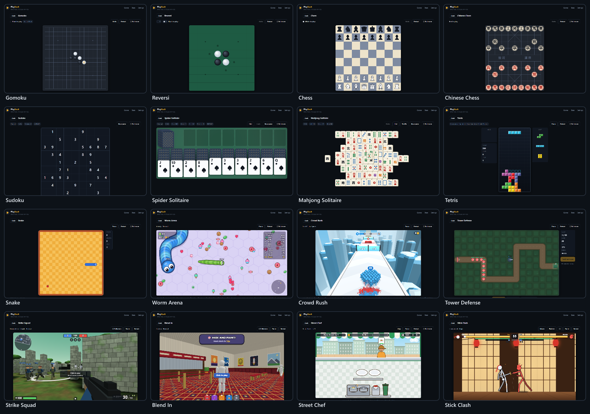

### The board family

Two seats, strict alternation, and one rule above all: `legalMoves()` is the only source of legality and `apply()` is the only way in, so an illegal move cannot exist anywhere — not on screen, not from the computer and not from a friend's browser.

- **The computer plays well, then blunders on purpose.** One strong strategy per game plus a blunder rate per level — easy, normal or hard. It never cheats; it chooses worse.
- **Two players on one device** (pass and play) or on two, over a room. Undo is off online: taking a move back on one board is exactly the disagreement a match cannot afford.
- **The rules are proved, not eyeballed.** Chess counts 20, 400, 8,902 and 197,281 positions at depths one to four — the published figures, the fourth in the suite's longer run — so one wrong pin, check or castling rule moves a number. Chinese Chess opens with exactly 44 legal moves, which catches a broken horse leg, elephant eye or river rule in one line.
- Chess pieces are Unicode glyphs drawn stroke first, then fill. The other way round, a 3px outline swallows the glyph and both sides come out the same colour.

### The puzzle family

One player, a deal worked out from a seed, undo, hints and a timer. The deal is a pure function of the seed and the difficulty, and every move returns its own inverse, so undo is free and a race can hand everybody the same deal.

- **Sudoku** checks uniqueness on every clue it removes, at four difficulties — easy, normal, hard and expert — so every puzzle has exactly one answer.
- **Spider Solitaire** deals two decks into ten columns in one, two or four suits: one to learn on, four to be beaten by. Its deals carry no guarantee — as in any Spider, some cannot be won.
- **Mahjong Solitaire** proves its own guarantee. The generator records the order in which it peeled pairs off the board, and the test replays that order to show every board can actually be cleared — a dead board is the thing players blame the game for.
- A puzzle in progress is saved and picked up again when the player comes back.

### The arcade family

A canvas and a fixed 60 Hz timestep with inputs applied on tick boundaries. The harness hands every frame the fraction of a tick since the last one, so a game can draw between ticks and still look smooth on a 120 Hz or 144 Hz screen. Nine games, from a two-minute Snake to four productions of 3,700 to 8,000 lines each.

- **Tetris** plays by the modern rules: a 7-bag randomiser, SRS wall kicks, hold and a ghost piece. There is no way to win, as its card says.
- **Snake** has three speeds, solid walls or wrap-around, and three rules for your own tail: deadly, trim (a bite cuts the tail off) and pass (the head goes through and counts the crossing). On wrap with a forgiving tail nothing can end the run — that is the mode, not a bug — so a race on those rules runs against a three-minute clock.
- **Tower Defense** has six maps rated one to four stars, some with two lanes that cross or merge. Easy, normal and hard keep the same twenty waves in the same order and change the enemies' health, speed and numbers, the starting gold, the lives (25, 20 or 12) and the rest between waves; hard adds a second boss to the last wave. Armour makes mixing towers the answer; bosses arrive from wave 10 and cost four lives; enemies rank up at waves 7 and 14. Normal was made harder by measurement: a strong bot needed only 54% of its gold to clear it and never lost a life — the same game as easy to anyone decent. It now needs 78%, and loses lives on four maps of six.

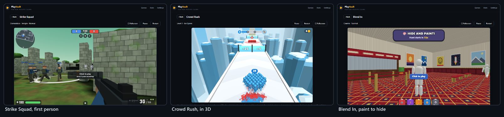

### Strike Squad — a first-person shooter

The biggest game in the hub: fourteen files and 8,018 lines of raw WebGL, built to the description of a reference that ships as a 134 MB Unity game.

- **Seven modes and a quick battle**: team deathmatch (to 75), free for all (to 30), domination (three points, to 200), capture the flag (to 3), search and destroy and elimination (rounds, no respawns, first to 4), and gun race (nineteen guns, then the knife). Quick battle draws a mode and a map from the seed, so a room's quick battle is the same one for everybody.
- **Eight maps** — Depot, Dust Town, Village, Frostbite, Downtown, Factory, Temple and Training Yard — laid out on a one-metre grid, most of them drawn half at a time and turned round for the other side, so a team map is fair by construction.
- **Twenty-two guns** across rifles, SMGs, shotguns, snipers, machine guns, pistols and blades — three to start with, the rest bought with coins as rank allows — each with four upgrade tracks of five levels, four attachment slots, thirteen camos drawn by the shader and a keychain that swings on its cord.
- **Clothes that change the numbers** (helmets and vests are armour, boots are speed, gloves are reload time, ghost boots are quiet), **skills** on 4, 5 and 6 (medkit, adrenaline, radar and shield), **three daily and three weekly missions** worked out from the date, and a crate every 25 kills and every 3 wins.
- **Bots find their way** with an A\* search over one-metre cells. The world is a height map, lit once when the map is built (30–130 ms) and a texture lookup per frame after that. Every sound is synthesised with the Web Audio API — the page's policy forbids loading media at all.
- **Settings in the match**: sensitivity from 0.1 to 5, aiming sensitivity, invert, aim assist, four crosshair shapes in six colours, field of view and brightness — in the lobby and on a pause card.

It was measured before it was tuned. Capture the flag first never scored — nine minutes on eight maps and not one flag moved — so attackers now take lanes and shoot on the move, and flags come home on six maps of eight. Search and destroy went to the same team on all eight maps, because soldiers updated in list order and the first squad always fired first on a shared tick; the order is now shuffled from the match's own RNG, and the same 24 matches split 12–12. Players then said easy and normal were too strong, and they were right: one bot killed a player standing in the open at 15 m in 1.38 s on easy and 1.13 s on normal. It now takes 6.2 s and 2.9 s, and hard is untouched to the hundredth.

### Blend In — hide and seek in paint

Six hiders paint their bodies to match a wall, a floor or a shelf and hold still; two seekers hunt them with water guns. Seventy-five seconds to hide and 120 to hunt.

- **The reference's paint panel and keys**: a colour wheel, a brightness bar, *Pick*, *Fill* and *Reset*, and brush sizes; WASD, Space to jump or climb a wall, E to paint, V for poses, Q for a free camera and F to lock in place.
- **Six maps chosen for their surfaces** — Subway, Cinema, School, Supermarket, Playground and Gallery — with fourteen poses (six free) and eight water guns (one free), the rest bought with coins.
- **Surfaces are functions, sampled once.** Every material is a pure function of its surface coordinates, sampled onto a grid of texels; the scene draws that grid and the engine reads the same one, so the colour the picker gives, the colour a bot paints and the colour a seeker compares are all the texel on screen. One light and no shadows, copied into the shaders to the digit, so a well-painted body is the same colour on screen as the wall behind it.
- **Bots see; they never know.** A seeker bot compares twenty points on every hider in view with what is behind each point from its own eye, and suspicion builds from a bad match, from movement and from a body that stands out. Hiding spots are found, not placed.

Balance, bots only, twelve rounds a line, hiders found out of six: normal seekers against normal hiders 1.7, hard seekers 2.8, easy seekers 0.3. In the browser, a player who stands in the open unpainted is found within the first fifteen seconds of the hunt.

### Stick Clash — a stickman fighter

A one-on-one fighter with a fighting game's discipline: J to attack, K for a special, a direction with K for two more, S to block, S+J to launch, S+K for an ultimate on a full meter, and K while being hit to break out.

- **Timed combos.** A press inside the window continues the chain and a press before it drops it, so mashing loses. There are launchers and air juggles, stamina that attacks and blocks both spend and that breaks a guard when it runs out, and a meter for breakers (half of it) and ultimates (all of it).
- **Eight fighters** — Ink (free), Blaze, Nox, Brick, Zephyr, Volt, Pike and Oni, the tournament's boss — with eight to ten moves each. The moves are data, and one skeleton posed by angles draws them all on a 2D canvas.
- **Four modes**: an eight-fight tournament whose bots sharpen fight by fight, versus the computer on four levels, two players on one keyboard, and training against a dummy that stands, blocks, jumps or fights back. Six stages. On any touch screen, a stick for the left thumb and four buttons for the right, so a direction and a button go together: under the fight on the page, and over it on the whole screen or on a phone on its side.
- **Everything that changes the fight is a tick** — hitstop, the knockout's slow motion, an ultimate's held screen — so a fight replays exactly from its seed. The shakes, flashes and trails live in the view.

Measured with bots: each level beats the one below it 12–14 times in 16, and expert beats easy 16 of 16. The first roster had one fighter winning 3 fights of 42 and another 31; two balance passes brought the seven regular fighters to 32–45 wins of 84 each, inside the noise, with the boss at 70 on purpose.

### Street Chef — a food-truck kitchen

Customers at the window order plates, sides and drinks, and the player cooks, plates, tops and serves before patience runs out or the food burns — by tapping, or by dragging anything to where it should go.

- **Seventeen streets of forty levels — 680 in all**, as the reference counts them: pasta, burgers, pizza, tacos and sushi, then hot dogs, sandwiches, breakfast, waffles, ice cream, barbecue, falafel, a wok, a bakery, a café, ramen and Nashville hot chicken. The menu is 118 parts of data, and every street has a kitchen of its own.
- **A level is a pure function of its street and number** — who comes, when, what they order and how patient they are — so a retry is the same level and a race is the same queue for everybody.
- **The coins stay on the counter** and hold the place until they are picked up. Stars come at three rising takings, and some levels add *don't burn anything* or *don't lose a customer*.
- **A kitchen shop for every truck**, gems for three boosters, a chef level, and trucks that open in order at their price.
- **The bot is also the tutorial.** `bot.js` plays every level in the tests, and on a truck's first level the pointing hand shows whatever the bot would do next.

Measured with the bot: the first prices were a gift — a casual career finished the first street with everything bought and 6,500 coins over — and the first chain broke at Sandwich Street, where upgrades cost five times the first truck's. After two passes, a simulated casual player clears all 680 levels in about 900 tries, and a quick cook with the kitchen bought three-stars every one of them.

### Crowd Rush and Worm Arena

Two games rebuilt from scratch when the first version was not good enough; the record of both rebuilds is in `docs/GAMES.md`.

- **Crowd Rush** is a crowd runner in 3D: grow a crowd through gates that add and multiply, trade runners one for one with red squads, then climb a rainbow staircase as a human tower (×1.0 to ×5.0) or bring down a crowned king. It draws with raw WebGL — every runner on screen is one instanced draw call, and the limbs swing in the vertex shader — for well under a millisecond of script a frame. A level is worked out from its number alone, so a lost level comes back exactly as it was; the test bot clears levels 1–12 every time and 27 of the first 30.
- **Worm Arena** is a round arena whose wall kills: the score is your size, size slows you down, and turbo burns mass and drops it behind you as food. Three modes (Infinity, Time and Treasure hunt), six potions, and eighteen skins — three free, the rest bought with coins found on the floor. Bots look down a fan of thirteen headings for the one that is clear; three measured fixes halved how often they died, and a full arena draws in 2–4 ms.

### The hub around the games

- **Lobby** — the player's level and XP bar, play with friends, a family filter and the game grid, each card showing how often it has been played and its best result. A game with options opens a sheet first: short choices as a segmented control; longer ones, or ones with a picture — map thumbnails painted by the game's own painter — as a grid of cards.
- **Profile and levels** — one name and one XP total across every game. Each level needs 100 XP plus 50 for every level already gained, so there is no wall.
- **Statistics** — games played, time played and level, then for each game: played, won, best and time.
- **Settings** — theme (dark or light), language, and the data row: *Auto*, *To Drive*, *From Drive*, *Export* and *Import*.
- **Full screen everywhere** — twelve games get ⛶ Fullscreen at the end of their bar from one shared helper, the four big productions bring their own, and the end-of-game card follows the game onto the full screen.
- **One end-of-game card** for every game, so its shape never surprises: a title, a few lines, *Play again* and *Back to games*.
- **A save that says when it cannot be made** — while the storage is full or refusing, a strip at the top of every screen says progress is not being saved and offers Export (see [When a save cannot be written](#when-a-save-cannot-be-written)).

### Out of scope

| Excluded | Why |
| --- | --- |
| Accounts, logins and a PlayVault server | The whole design is that nothing needs one; the Drive copy uses the player's own Google account |
| Global leaderboards and ranked matchmaking | A score from a browser is a claim; an honest board needs a server that re-runs the game |
| Online shooter matches against people | State at 60 Hz needs a server; with friends, the shooters race a shared seed |
| Adverts, purchases and real money of any kind | Coins, gems and XP are earned and spent in play, and nowhere else |
| Chat, friends lists and public profiles | A social network is a different product, with moderation nobody here can staff |
| A reference game's art, names, characters or code | Only the mechanics its store page describes; everything drawn here from scratch |
| Kart racing | Built, measured, fixed — and removed on request on 22 September 2026; a circuit racer replaces it in Phase 4 |

## System architecture

PlayVault is a static site: an HTML page, one stylesheet, one script bundle and a lock, served by GitHub Pages. Nothing runs on a server. Everything a game needs is in the page; the only calls it makes go to a broker that introduces friends' browsers to each other and — only when the player asks — to Google Drive.

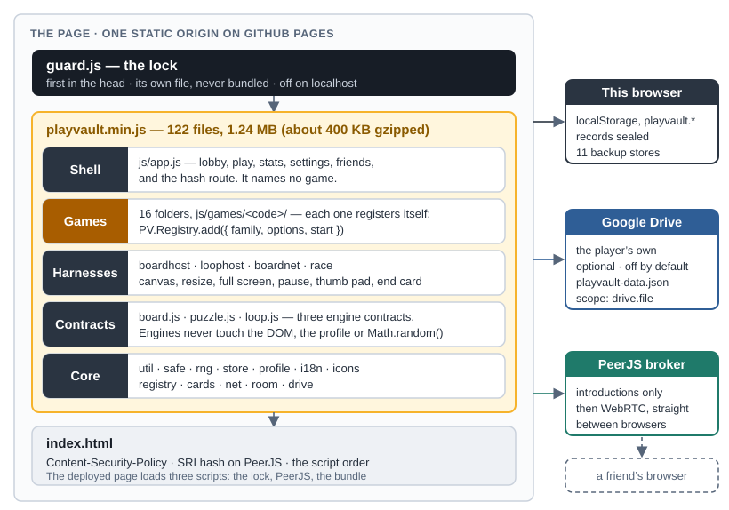

### How the stack got here

| Decision | When | Why | Rejected |
| --- | --- | --- | --- |
| Classic `<script>` tags into one `PV` namespace, no framework | 7 Sep | The shape CardVerse and MiniShoppingMall had already proved; the debugger shows real files | ES modules and a bundler; React |
| Three engine contracts, not one | 7 Sep | Phase 1 built the simplest game of each family to prove all three before anything was built on them | CardVerse's single contract, which this roster does not fit |
| Shared harnesses for board and real-time games | 7 Sep | By the fourth board game, a new one was `create/draw/hit/status/outcome` and nothing else | Each game owning its canvas, undo and end card |
| Friends over WebRTC, ported from CardVerse | 8 Sep | The model, and its bugs, had been paid for once; two mechanisms chosen by family | A game server |
| Kart Racing measured, fixed, then removed | 22 Sep | Its controls arrived on 41% of ticks and rivals spent up to 83% of a race on the grass; fixed, then removed on request | Tuning by feel |
| Untrusted input rebuilt everywhere it enters | 22 Sep | An `xp` of `1e308` in storage hung the tab on every load | Checking imports only |
| One stripped bundle, versioned by hash; sealed records | 22 Sep | A tidier deployed page, and a hand edit that no longer survives a refresh | A manual `?v=` bump |
| 3D in raw WebGL, no library | 24 Sep | A 600 kB engine for one game would have been the first exception to both no-dependencies and the page's policy | three.js, Babylon.js |
| The Google Drive copy, ported from CardVerse | 25 Sep | The shared GameHub client already covered this origin; nothing to set up | A PlayVault account |
| The lock | 29 Sep | A programmer friend changed a save from the console, and it survived a refresh | Obfuscation, which protects nothing |
| A relay made ready, all but its account | 29 Sep | No free relay without an account is left; its credentials get a file of their own, checked before use, and `?relay` proves one from two tabs | Running a relay ourselves, which is a server |

### Script order and the pieces

`index.dev.html` loads every file separately — core, contracts, harnesses, games, then the shell, in that order, because each file hangs its part on `PV` as it loads. It is the page to work against. `index.html` is generated from it: the lock first in the head, PeerJS pinned by hash, and the one bundle.

| File or folder | Lines | Holds |
| --- | --- | --- |
| `js/core/i18n.js` | 2,665 | English and 简体中文, one flat dictionary each, 1,256 keys apiece |
| `js/core/guard.js` | 786 | The lock — first in the head, never bundled |
| `js/core/drive.js` | 701 | The Drive copy: sign-in, the queue, *To*, *From* and *Auto* |
| `js/app.js` | 581 | The shell: lobby, play, statistics, settings, the hash route and the saving strip — no game named |
| `js/core/net.js` · `room.js` | 432 · 357 | The pipe (WebRTC, room codes and the relay's checked entries) and the room over it |
| `js/core/boardhost.js` · `loophost.js` | 350 · 357 | The two shared harnesses |
| `js/core/race.js` · `boardnet.js` | 305 · 137 | The two ways a game is shared |
| `js/core/store.js` · `profile.js` · `safe.js` | 247 · 185 · 124 | Persistence, seals and refused writes; the player and their records; rebuild, never adopt |
| `js/core/board.js` · `puzzle.js` · `loop.js` | 120 · 91 · 121 | The three engine contracts |
| Other core files | 824 | Helpers, the seeded RNG, the registry, icons, cards, the friends screen, the room's interface, Drive settings, the relay's credentials |
| `js/games/` | 36,631 | Sixteen game folders (99 files) and the empty `stubs.js` |
| `css/app.css` | 1,482 | One stylesheet: the hub's colours are tokens, dark and light; the big games' panels use fixed colours |
| `tools/` | 5,296 | The test suite, the lock check, the build and minifier, the logo builder and a dev server |

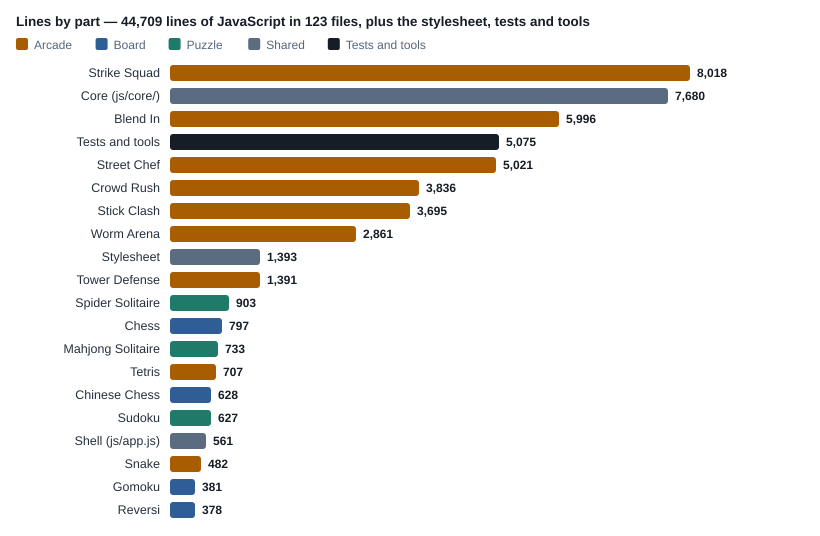

### The game contract

What a game hands the registry, and what the shell hands back:

```
PV.Registry.add({
  code, family,                 // family: 'board' | 'puzzle' | 'arcade'
  name, nameZh, blurb, blurbZh, icon,
  options: [ { key, labelKey, def, choices, solo, showIf, grid } ],
  start(host, ctx)  ->  { destroy(), park(on) }
})

ctx = { code, opts, host, room, race,
        seed(),                 // in a room, the host's seed
        record(outcome),        // the shell decides what an outcome is worth
        gameOver(panel), panel(panel), closePanel(), exit() }
```

The registry refuses a duplicate code, an unknown family and a game with no `start()`. An option with more than three choices, or with a picture or a tag, becomes a card grid; a `solo` option — versus the computer, or pass and play — disappears in a room, because the opponent is a person on another device.

### The three contracts

| Contract | File | Harness | The rule that matters |
| --- | --- | --- | --- |
| Turn-based board | `js/core/board.js` | `boardhost.js` | `legalMoves()` is the single source of legality, and `apply()` is the only way in |
| Solo puzzle | `js/core/puzzle.js` | — | The deal is a pure function of (seed, difficulty); every move returns its own inverse |
| Real-time loop | `js/core/loop.js` | `loophost.js` | Fixed timestep, inputs applied on tick boundaries, so a run replays from its seed |

A board game supplies `create/draw/hit/status/outcome`; a real-time game supplies `create/draw/keymap/pad/outcome`. A game with touch controls of its own, like Stick Clash, leaves out `pad` and holds and releases actions through the harness, so a thumb holding the stick to one side is sampled on the tick exactly as a held key is. Held keys come in two kinds and a game must say which it wants: `repeatable`, the Tetris kind — one press, a pause, then steady steps — and `sustained`, the steering kind, re-queued on every tick. Kart Racing felt wrong because a driving game was being fed a Tetris key repeat, and a held arrow delivered 78 degrees a second of the 189 it asked for.

### Build, deployment and cache busting

`node tools/build.js` reads the script list from `index.dev.html`, strips the comments and indentation from 124 files — about 1.97 MB of commented source — and writes `js/playvault.min.js` (1.25 MB, about 400 KB gzipped) and the deployed `index.html`. The live site is the `main` branch root of the public repository `KaonHew02/PlayVault`.

**The version is a hash of the sources** — the lock, the stylesheet and every bundled script — stamped on the `?v=` of all three, so a browser holding an old bundle or an old stylesheet always fetches the new one and there is no manual version bump to forget. The stylesheet joined the stamp on 30 September: GitHub Pages lets a browser keep a file for ten minutes, and until then a returning player could run the new scripts with yesterday's styles and see a new control laid out as nothing. The lock goes in as its own tag and is never bundled: it tells PlayVault's code from a console's by the address on the call stack, and inside the bundle every frame would carry the same address. On 30 September the live page served `?v=02c3661d0534` on all three, the same stamp as the working tree.

Two guards make the build safe to trust. The whole suite runs against the minified source (`smoke.js --min`), and the bundle carries a hash of its inputs that the suite checks — so a bundle one edit behind the code fails the tests instead of failing in production.

## Playing with friends

One player opens a room and reads out six digits; everybody else types them in. The browsers find each other through PeerJS's free public broker, and from then on everything goes directly between them over WebRTC — **no server holds the game**. The model is CardVerse's, ported rather than re-derived.

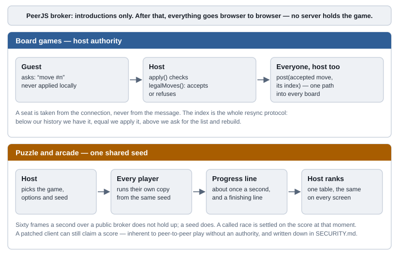

### Board games: host authority

- **A move is an ask, never applied locally.** The guest asks; the host checks the move through `apply()` and posts the accepted move to everybody, itself included — so both players take the same path into their board, and there is no second code path that only one of them runs.
- **A seat is taken from the connection, never from the message.** That single rule is all of "you cannot move for me".
- **The guest holds a real engine.** These four games are full-information and deterministic, so replaying accepted moves gives the same board — and the guest gets legal-move highlighting and the end-of-game test for free.
- **One number is the whole resync protocol.** Every accepted move carries the index it was played at: below our history we already have it, equal to it we apply it, above it we ask for the move list and rebuild.
- **A rematch is taken by both boards or neither**, and it is the host's to start. A seat is never reused after a drop.

### Puzzle and arcade: one shared seed

- The host picks the game, its options and the seed, and every player simulates their own copy — which is why the same deal, the same map and the same bots appear on every screen.
- A race sends **a progress line about once a second and a finishing line**, and nothing else. Sixty frames a second of somebody's Tetris does not hold up over a public broker; a seed does.
- **Only the host ranks**, so every screen shows the same table: puzzles by time, arcade games by score. A race the host calls early is settled on what everybody has at that moment, so a host who has crashed out cannot call the race and take the medal.
- **A race is even.** Nobody brings upgrades: Strike Squad players fight with stock guns and no clothes, every Stick Clash player is Ink against the same seeded opponent, and start lines are skipped so that nobody stands waiting while the others run.

### Lessons paid for in real browsers

Every game was walked through a room — join, play, finish, rematch, and *Back* in the middle — before this section was true. What broke, and what holds now:

- **Back is not leaving.** *Back* on an online game used to rebuild it from nothing: an empty board on the host, a guest stuck on the wrong turn, a race restarted on the same deal. A game still being played is now put aside, still connected, and *Back to the game* puts the same screen back.
- **PeerJS loads `async defer`**, so the friends screen can appear before it arrives. The screen waits for it rather than announcing that online play is unavailable.
- **Two tabs on one machine prove nothing about two networks.** They always find a direct route; a friend on mobile data often cannot, and then only a TURN relay gets through. PeerJS's own relay stopped resolving (checked on 23 September 2026), and no free relay without an account remains: checked again on 29 September in a headless Chrome asking each for a relay, freeturn.net and PeerJS's own no longer resolve, and Metered's shared relay refuses every connection. So everything but the account is built. `js/core/relay-config.js` holds the credentials, public by design as in every browser app that uses TURN; `net.js` takes only entries it can use, since a bad one would fail in silence; and `?relay` in the address forces every connection through the relay — the one way two tabs on one machine can show it works. Empty, play is exactly as before. **The account, and a match between two real networks, is Phase 4's first item.**
- **What a room cannot do is make a peer honest.** On a shared seed with no server, a patched client can claim a score it did not earn. That is inherent to peer-to-peer play without an authority; it is written down rather than pretended away, and rooms are six digits read out loud to people you know.

### Limits of a room

Two seats for a board game, and two to four players in a race — six at most, whatever a game asks for. Names are capped at 24 characters, a roster arriving from another browser is cut to sixteen entries, and seats, levels, options, seeds and scoreboard rows are rebuilt and clamped as they arrive. A guest may only ask or announce — the host alone begins a round, rewrites the roster or ends the game — and a guest who un-hides the host's buttons finds they check `room.isHost`, not the button.

## Data model and storage design

Every save lives in the browser's own `localStorage`, under keys prefixed `playvault.`, and every value goes through `PV.Store` — so one list decides what travels in a backup, and every read is checked by the module that owns the value.

| Key | Owner | Holds | Sealed | In the backup |
| --- | --- | --- | --- | --- |
| `profile` | Profile | Name (24 characters), XP, the date it was created | Yes | Yes |
| `stats` | Profile | For each game: played, won, lost, drawn, best score, best time, time played | Yes | Yes |
| `sudoku.saved` · `spider.saved` · `mahjong.saved` | The puzzles | The game in progress, resumed on return | No | Yes |
| `crowd.meta` | Crowd Rush | Coins, level, the two upgrades, colour and hat | Yes | Yes |
| `worms.meta` | Worm Arena | Coins, the skins owned and the one worn, food, floor, the potion upgrade | Yes | Yes |
| `fps.meta` | Strike Squad | Coins, XP, guns, upgrades, attachments, camos, keychains, clothes, skills, the kit, missions and crates | Yes | Yes |
| `hide.meta` | Blend In | Coins, XP, poses and water guns, lifetime record | Yes | Yes |
| `stick.meta` | Stick Clash | Coins, fighters owned, tournament progress, lifetime record | Yes | Yes |
| `chef.meta` | Street Chef | Coins, gems, XP; for each truck, whether it is open, the stars and best takings for every level, and its kitchen | Yes | Yes |
| `fps.settings` · `hide.settings` · `stick.settings` · `chef.settings` | Four games | Mouse, crosshair, sound and display settings | No | **Never** — they belong to the device |
| `theme` · `lang` · `drive.auto` · `drive.lastPush` | Shell, languages, Drive | Settings for this device | No | **Never** — they belong to the device |

### Seals, and what they are for

The profile, the statistics and every game's record of coins and unlocks are stored with a checksum of themselves. A value edited in the browser's Application tab no longer matches its checksum and is dropped on the next read, so the edit does not survive a refresh. Every backup file carries a seal over its whole envelope as well.

The seals are **a speed bump, filed as one**: the salt is in the same public JavaScript the player already has, so somebody who reads the source can compute a seal by hand. What they stop is what actually happens — a number typed into the developer tools, or a save file edited in Notepad. A record sealed by any earlier version still opens, and records from before seals existed were sealed once, on first load.

### Rebuild, never adopt

Every value read back out of storage passes the validator registered by the module that owns it — not only values that arrive by import. Strings are coerced, stripped of control and direction-changing characters and cut to length; numbers are clamped; unknown fields are dropped; and `__proto__`, `constructor` and `prototype` keys never get through. Records are rebuilt field by field, never copied with `Object.assign`, because an own `__proto__` key copied that way swaps the target's prototype instead of adding a key.

This closed a real bug. The player's level was found by walking one level at a time from zero, so an `xp` of `1e308` — typed into the developer tools, or left by a corrupted write — meant about `1e153` steps: a tab that hangs on every load, because the bad value is still there. XP is now clamped on read and the walk bounded at 4,500 steps.

### When a save cannot be written

Every write goes through `PV.Store.set()`, and since 29 September the store knows when the storage refuses one: full, because every site on `kaonhew02.github.io` shares one quota, or blocked, as in some private windows. Until then a refused write vanished — and because a full storage still reads, the game read back the older value, so XP, coins and stars stopped adding up the moment the storage filled. Now:

- **A key whose write failed is read from memory** until a write of it lands, so the game keeps counting.
- **Every write that lands retries the rest**, so all of it is saved as soon as there is room again.
- **A strip at the top of every screen** says, in both languages, that progress is not being saved, and offers Export — which reads the same memory, so it keeps what the storage would not. It goes as soon as everything has landed, and it sits inside `#app`, where the lock guards it like the rest of the screen.

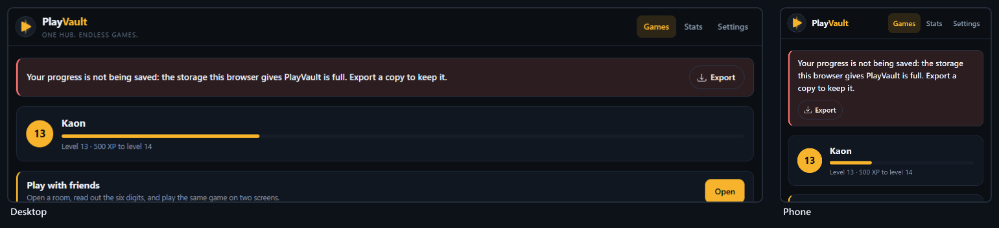

### Export, import and the Drive copy

Export writes every backup store into one sealed envelope, `playvault-data.json`:

```
{ format: 'playvault.backup', version: 1, saved: '<ISO time>',
  data: { ...every BACKUP_STORES key that holds a value },
  seal }
```

**Import refuses before it reads.** A file from another app, a file whose seal no longer matches and a file with no seal at all are refused whole — an unsealed file cannot be told apart from an edited one. Even a sealed file is not believed: it is rebuilt from scratch, with plain objects and arrays only and bounded depth, key count and string length, and each store passes its own validator or is skipped rather than restored badly. Import replaces each store the file carries and leaves the others as they were.

**The Drive copy is the same file in the player's own Google Drive**, in a `GameHub` folder, written by the same `exportAll()` and read back through the same `importAll()` — one format, three ways in.

- The scope is `drive.file`: only files PlayVault itself created. It cannot list, read or touch anything else in anybody's Drive, and it needs no review by Google.
- The access token lives in memory only; a reload forgets it. The OAuth client ID is public by design, and there is no client secret.
- Google's sign-in script is fetched only when Drive is about to be used — Settings opened, a reach for *Load from Drive*, or *Auto* with something to send. It is the one script that cannot be pinned by hash, so a player who does none of those never runs it.
- **Auto** is off by default; switched on, it sends a copy about a minute after the last change. File work is queued, so a press and an automatic save can never both create the file.
- On an empty browser, the Games screen offers *Load from Drive* — because the person whose browser was just cleared is exactly the one who does not know to look in Settings. A Drive file over 4 MB is refused before it is parsed; a real save is a few kilobytes.
- **Never rename the file or the format**: a renamed file orphans every copy written under the old name.

Today only the GameHub consent screen's test users can sign in; Phase 4 publishes it in week 3.

### Migration is part of the job

Three changes have already carried old saves forward: the seals, where every unsealed record was sealed once and a record sealed by any earlier version still opens; Street Chef's growth from twenty levels a street to forty, where an old save keeps its stars and kitchen and the new levels open behind the old; and Crowd Rush's rebuild in 3D, whose two upgrades take their levels from the old ones. The suite holds the first two.

## Security and anti-cheat

A static site with no server and no accounts has no password database to leak and no other player's data to reach, so its threat model is short — but it is not empty. The security work of 22 and 29 September was driven by two concrete findings: a stored value that could hang the tab on every load, and **a programmer friend who changed a save from the published site's console and watched it survive a refresh.** Both are closed.

### Can the JavaScript be hidden?

No — not here, and not anywhere. A browser cannot run code it has not been given, and whatever it has been given can be read, paused and changed. The deployed bundle is stripped of comments, which makes it tiresome to read and protects nothing. The question worth asking is what it costs if somebody changes it, and here the answer is: nothing that belongs to anybody else. A player who gives themself a million XP has cheated at solitaire, on their own machine.

### Threat model

| Threat | How it would arrive | Status |
| --- | --- | --- |
| A line pasted into the console | `PV.Profile.addXp(…)`, `localStorage.setItem(…)` | Closed — `PV` is undefined after load; storage and page writes are refused |
| An edit in the Elements panel | A number typed over, `disabled` removed, a node deleted | Closed — put back as it lands; every button re-checks the save anyway |
| An edited backup | Export, change `coins` in a text editor, Import | Closed — backups are sealed, and an unsealed file is refused too |
| An edited Drive copy | Download, edit and upload again in Drive | Closed — the same seal, checked before the file is even described |
| An edited stored record | The browser's Application tab | Closed — dropped on the next read |
| A hooked built-in | Replacing `Math.random`, `performance.now`, `JSON.stringify` or WebGL | Closed — the language is frozen |
| A value that hangs or breaks the app | `xp: 1e308`, a `__proto__` key, a huge file | Closed — rebuilt, clamped and bounded on every read |
| A hostile peer in a room | An oversized name, a forged seat, a guest acting as host | Closed — every field rebuilt and capped; seats from the connection; host authority |
| A tampered copy of PeerJS | A changed file on the CDN | Closed — Subresource Integrity makes the browser refuse it |
| A patched client in a race | A score it did not earn | Accepted — inherent to peer-to-peer play without an authority |
| A debugger, Local Overrides or a hand-computed seal | Somebody reading the source | Accepted — needs the source open, and changes only their own machine |
| Another app on the same origin | Every page on `kaonhew02.github.io` shares one `localStorage` | Open — the seals still apply; an origin of its own is decided at MS-3 |
| Clickjacking, content sniffing, a hostile opener | Needs response headers | Open — GitHub Pages cannot send them; the same MS-3 decision |

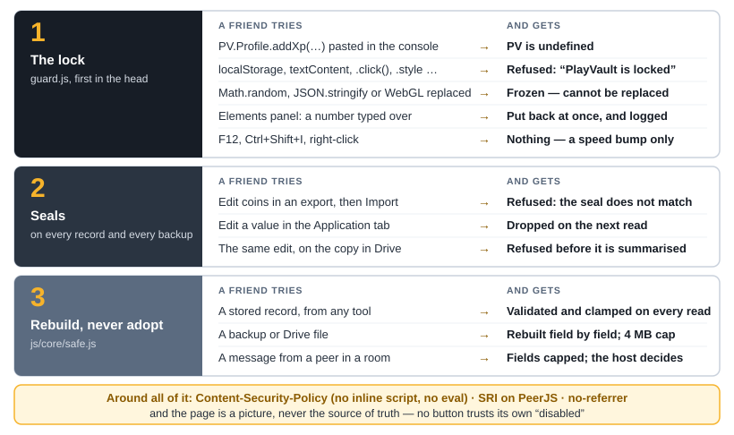

### The lock

`js/core/guard.js` is the first script on the page, in the head, before anything else can run. It is **on for the published site and off on the developer's machine** — on `localhost`, `127.0.0.1` and a file on disk the console is the developer's own tool, and `?guard` in the address switches the lock on to try it. It does five things:

1. **The namespace is not a global.** While the page loads, `window.PV` answers only to PlayVault's own scripts; once the page has loaded it answers nobody. Every module took its own reference as it loaded, so the games carry on and the console finds `PV` undefined.
2. **Storage answers only to PlayVault's code** — `localStorage`, `sessionStorage` and every method on them.
3. **The page is PlayVault's.** Every way a script can change what is on screen — an attribute, a class, a style, text, a node, a click, a listener, a window — is wrapped: asked by PlayVault it works as it always did, asked by anything else it throws. Reading is left alone.
4. **What changes anyway is put back.** The Elements panel goes through no script, but a `MutationObserver` sees it, and a change that none of PlayVault's own calls made is undone as it lands — except a new `data-` attribute, which is how extensions mark a text box, and the browser's own page translation, which the player asked for.
5. **The language is frozen** — `Object`, `Array`, `JSON`, `Math`, `Date`, `Promise`, `performance`, the 2D canvas, WebGL and the input events.

**How it knows who asked:** from the call stack. Code typed into a console has no address, a snippet or an extension has somebody else's, and a page method handed to a timer from the console has no caller at all — all refused. PeerJS and Google's sign-in script are let through by address, because they call back in. A browser that writes its stacks in a way the lock does not recognise gets no lock, rather than a game that refuses its own code.

**What it costs:** reading a stack costs 30–60 microseconds, so the lock reads one only for a change to something on screen, and never for a write that changes nothing. Measured in Chrome on the built bundle, most games ask the lock nothing in a frame — the puzzles about once a second, for their clocks — and script time with and without it is within the noise of the measurement (0–13%). Page load is unchanged.

### Page-level controls

- **Content-Security-Policy** in the page: `default-src 'self'`; scripts from this site plus exactly two outside files, each named down to the file — PeerJS 1.5.4 on cdnjs, not the whole of cdnjs, and Google's sign-in client; no inline script and no `eval`; `media-src 'none'`, `object-src 'none'`, `base-uri 'none'` and `form-action 'none'`; network calls only to the PeerJS broker and Google.
- **Subresource Integrity** on PeerJS, pinned by `sha384`. If the CDN ever serves different bytes, playing with friends stops working and nothing else does — the right way round.
- **`referrer: no-referrer`**, so no address of the player's leaks to the CDN or to Google.
- **No `eval`, `new Function`, `document.write` or string timers.** The only `innerHTML` writes the game icons, which are static SVG in the repository; everything from a player, a peer or a file goes into a text node.
- **The page is a picture, never the source of truth.** No button trusts its own `disabled`, and no handler reads a price, a level or a count back out of the page — every shop, unlock and claim re-checks the save it was handed.

### What still gets through, honestly

- **The browser's own menu** opens the developer tools whatever a page does. F12, Ctrl+Shift+I and right-click are blocked as a speed bump, not a lock.
- **A breakpoint** inside PlayVault's code puts the console in that function's scope, and nothing a page runs can switch the debugger off. **Local Overrides** can serve an edited copy of any file, the lock included.
- **A seal worked out by hand** from the public source.
- **Another page on `kaonhew02.github.io`.** CardVerse, GameTable, MoneyFlow and the rest share one origin and one `localStorage`, and their consoles are not locked by this file. The seals still apply there.
- **Response headers** — `frame-ancestors`, `X-Content-Type-Options`, `Cross-Origin-Opener-Policy` — need a host that can send them, and GitHub Pages cannot.

What is gone is the cheap cheat: a line pasted into the console, a number typed over, a file edited in Notepad. Every way that is left needs a debugger or the source, and changes numbers that matter only on that one machine.

### Privacy by construction

No account, no analytics, no advert, no tracker and no cookie banner, because there is nothing to consent to. Saves stay in the browser. The page fetches the PeerJS library from cdnjs as it loads, with no referrer, and talks to the broker only for a room. It fetches Google's sign-in script only when Drive is about to be used — Settings opened, a reach for *Load from Drive*, or *Auto* on — and a save goes to Google only when the player presses *To Drive* or has *Auto* on. PlayVault has no server of its own to receive anything.

## Brand, UI and UX design

PlayVault is brass on steel: a near-black blue-grey page, panels a shade lighter, and one warm accent that marks what to press. It reads as a vault — solid, dark and a little precious — with the play button as the one bright thing in it.

### Identity

|  |  |
| --- | --- |
| Name | PlayVault — one word, `Play` in ink and `Vault` in brass |
| Slogan | *One Hub. Endless Games.* — the page title, and the line under the wordmark |
| Mark | A bolted vault split down the middle, its doors parted on a seam of light, with the play button bridging both halves |
| Chosen | 7 September 2026, over a closed vault door, a combination dial and a PV monogram |

**A mark is judged at 16 px, not 128.** The seam must stay narrow, the play triangle must overlap *both* doors, and the bloom behind it must stay small, or the mark turns into an amber blob. `logo-simple.svg` drops the bolts and the frame for 16–32 px and grows the play button. Every asset — the mark, the simple mark, a square icon and favicon, the lockups, the wordmark and a 1200×630 social card — exists in brass and in an alternate *neon vault* skin, and every one is generated by `tools/build-logo.mjs`; no logo file is edited by hand.

### Palette

| Token | Dark (default) | Light | Use |
| --- | --- | --- | --- |
| Page | `#0B0F14` | `#F1F4F9` | The ground |
| Panel | `#111721` | `#FFFFFF` | Cards, sheets and bars |
| Ink | `#EAF0F7` | `#101720` | Primary text |
| Muted | `#8494A8` | `#5E6D80` | Secondary text |
| Dim | `#5E6D80` | `#8494A8` | Quiet labels: table headings, tile captions, the slogan |
| Accent (brass) | `#F6B32B` | `#B67512` | What to press, and the current tab |
| Good · bad | `#34D399` · `#F87171` | `#0E9F6E` · `#D64545` | Wins and losses |

The brand pair itself is `#F6B32B` on `#171D26`, with `#0D1218` for game interiors; the neon vault skin, `#25D8F2` on `#171034`, is a dark-arcade alternative, not the brand. The hub's own interface takes every colour from a token defined once on `:root` and overridden once for the light theme — a colour defined only in one theme is missing in the other, which is the usual way a theme switch half-works. The big games' own panels are the exception: about 350 fixed colours, which look the same in either theme. The layout is mobile first, and nothing may scroll sideways at 360 px.

### Accessibility, measured

Contrast was computed from the tokens, not eyeballed:

| Pair | Dark | Light | WCAG AA (4.5:1) |
| --- | --- | --- | --- |
| Ink on a panel | 15.67:1 | 18.02:1 | Pass |
| Muted on a panel | 5.81:1 | 5.28:1 | Pass |
| Ink on the saving strip | 14.05:1 | 14.36:1 | Pass |
| A label on a brass button | 10.43:1 (dark on brass) | 3.79:1 (white on brass) | Dark passes; **light fails** |
| Brass text on the page | 10.43:1 | 3.44:1 | Dark passes; **light fails** |
| Dim on a panel | 3.40:1 | 3.10:1 | Below AA — small capitals used as quiet labels |

**The dark theme — the default — clears AA on everything that carries meaning. The light theme does not**: its brass is too light to carry white text on a button. The fix is one token, `#9B630F` in place of `#B67512`, which gives 5.02:1 under white text and 4.55:1 as text on the page, and it is part of Phase 4's contrast pass. The dim labels sit below AA on purpose, as a hierarchy decision — but 10–11 px capitals are exactly where low contrast hurts most, so the same pass re-measures them.

### Layout and interaction

A sticky top bar carries the mark and three tabs — Games, Stats and Settings — over a single centred column. The lobby is a grid of game cards, four across on a laptop and two on a phone. Playing a game keeps the page around it: *Back*, the game's name, a bar of the game's own buttons with ⛶ Fullscreen among them, and a canvas measured to the room it has.

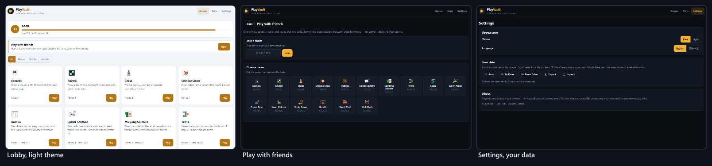

- **Every game has a Fullscreen button.** Twelve get it from one shared helper, at the end of the bar and hidden where a browser does not offer full screen; Strike Squad, Blend In, Stick Clash and Street Chef bring their own. The end-of-game card follows the game onto the full screen.
- **Touch is part of the contract.** A thumb pad appears on every touch screen — a tablet, or a phone on its side, as much as a phone upright — and on a tablet the board leaves it room, so both fit on the screen at once. Snake's comes from the loop harness; Tetris lays its six buttons in one row on a phone on its side. Stick Clash has a stick for the left thumb and four buttons for the right, over the fight on the whole screen or on a phone on its side. Board games take taps, Street Chef takes taps and drags, and Worm Arena moves its map out of the turbo button's way. Until 30 September those three pads showed only on screens narrower than 760 pixels, so on a tablet, or a phone on its side, Snake, Tetris and Stick Clash had no controls on the screen at all.
- **Sound is made, not loaded.** Strike Squad, Blend In, Stick Clash and Street Chef synthesise every sound with the Web Audio API, because the page's policy forbids media files. The other twelve games are silent today; Phase 4 gives them sound and the hub one volume control.
- **Two languages throughout.** 1,256 keys in each, the same set in both; the language is switched in Settings and remembered on the device. Half the roster had Chinese names from the start, and now every game has both.

### Family resemblance, on purpose

PlayVault is one of a family of apps by the same developer and shares their shape: vanilla JavaScript in one namespace and nothing to install; a Settings data row with the same pills, icons and order as MoneyFlow, FinSim and PlanSphere, in PlayVault's brass; and the Drive copy on the GameHub client it shares with CardVerse. What must not travel is the look. PlayVault is brass on steel, and a change to a sibling must not drift it.

## Technology stack and tooling

Every choice here was made against one constraint: **the hub should still run from a copied folder in ten years**, with no toolchain to reinstall and no package to have gone unmaintained — and adding a game must never need an exception to that.

| Layer | Choice | Why | Rejected |
| --- | --- | --- | --- |
| Language | Vanilla JavaScript; classic `<script>` tags into one `PV` namespace | No transpile step; the debugger shows real files through `index.dev.html` | TypeScript and a bundler — a build for one developer |
| Interface | The page built by `PV.el` (text nodes, never HTML) and one tokenised stylesheet | 581 lines of shell do what a framework's runtime would | React, Vue |
| 2D games | Canvas 2D | Each game draws its own world; nothing to load | Phaser, PixiJS — a dependency and an exception to the page's policy |
| 3D games | Raw WebGL 2, or WebGL 1 with instancing; shaders in GLSL ES 1.00 | Crowd Rush, Strike Squad and Blend In, with no library | three.js, Babylon.js — about 600 kB for one game |
| Sound | Web Audio API, synthesised | `media-src 'none'`; nothing to download | Audio files |
| Randomness | Seeded `PV.RNG` | Replays, races and tests | `Math.random()`, banned in engines |
| Storage | `localStorage`, with a memory fallback | A save is a few kilobytes | IndexedDB — not needed at this size; a server database |
| Backup | A sealed JSON file; Google Drive with `drive.file` | A file the player owns, readable without PlayVault | Accounts; a proprietary format |
| Friends | WebRTC through PeerJS 1.5.4, pinned by hash; Google and Cloudflare STUN; a TURN relay from `relay-config.js` once it holds one | Browser to browser; the broker only introduces | A game server |
| Languages | One flat dictionary per language, looked up lazily | 1,256 keys, no library | i18next |
| Icons | A few line icons from Bootstrap Icons (MIT), inlined | No font to request | An icon font from a CDN |
| Hosting | GitHub Pages, `main` branch root | Free, versioned and public | Paid hosting |
| Build | `tools/build.js` and `minify.js` — 316 lines, no npm | One stripped bundle; it, the lock and the stylesheet versioned by a hash of their sources | webpack, esbuild |
| Tests | `tools/smoke.js` in Node; `tools/lockcheck.mjs` driving Chrome over the DevTools protocol | 2.56 million checks and a real browser, with no dependencies | Jest, Playwright — dependency trees |
| Logo | `tools/build-logo.mjs` | The art is code: one source for every file | Hand-edited SVGs |
| Local server | `tools/serve.js`, 30 lines | Nothing to install | Vite, live-server |

### The two outside scripts, and why they are acceptable

**PeerJS** is needed only for playing with friends. It is pinned by hash and loaded `async defer`, and the app is built to carry on without it: if it never arrives, the friends screen says so and every game still plays. **Google's sign-in client** is needed only for the Drive copy. Google serves it unversioned, so it cannot be pinned, and it is therefore never on the page until Drive is about to be used. Neither is load-bearing for a single game.

### Development workflow

1. Edit the sources, and work against `index.dev.html`, which loads every file separately with its real name and line numbers.
2. `node tools/serve.js 8099`, then open `http://localhost:8099/index.dev.html`. The lock is off on `localhost`; add `?guard` to see the published site's behaviour.
3. `node tools/smoke.js` — or `--only "<section>"` for one part — about half a minute for the whole suite.
4. `node tools/build.js` to write the bundle and the deployed `index.html` — after a change to the stylesheet as much as to a script — then `node tools/smoke.js --min`.
5. `node tools/lockcheck.mjs` after anything that changes how a game draws its bar or panels; `--net` adds Drive and a two-tab room.
6. Commit and push `main`, and GitHub Pages redeploys. Check that the live page's `?v=` stamp matches the build.

### Development traps

- **Anything a view calls while it is being built must be declared above that call.** A `let` or `const` further down is still in its temporal dead zone, the view dies half-built, and its key listeners stay behind to throw in every game played after it. It has happened three times.
- **`PV.t()` is looked up lazily, and through the module's own `PV`, never `window.PV`.** On the published site `window.PV` answers nobody once the page has loaded, so a lookup through it works on `localhost` and fails in production.
- **A change of hash does not reload scripts.** After editing a file, change the query string before believing a fix has failed.
- **Settle performance by counting, not timing.** In a hidden, software-rendered preview pane, timings of identical runs swung by a factor of a hundred.

## Project plan and timeline

Three phases are complete. Phase 4 is what this proposal asks approval for: twelve weeks from 5 October to 27 December 2026, closing the three open objectives and releasing v1.0.

### Phases 1–3 — delivered

| Phase | Dates | Delivered |
| --- | --- | --- |
| **1 · Foundation** | 7–8 Sep 2026 | The hub shell and the three contracts, each proved with the simplest game of its family; eleven games; the two harnesses; playing with friends, by host authority and by shared-seed race; Spider Solitaire and Worm Arena added and Klondike removed on request |
| **2 · Rebuild and harden** | 22–24 Sep 2026 | Kart Racing made to drive properly by measurement, then removed on request; Tower Defense rebuilt with six maps and three difficulties; Crowd Rush built, then rebuilt in 3D; Worm Arena rebuilt and redrawn; untrusted input rebuilt everywhere it enters; the stripped bundle and sealed records; five fixes to playing with friends, found by walking every game through a room |
| **3 · The big productions** | 25–30 Sep 2026 | The Google Drive copy; Strike Squad; Blend In; bot difficulty measured and eased; Stick Clash; Street Chef, grown to 680 levels; full screen on every game; the lock; this proposal; the stylesheet versioned with the scripts; and, early from Phase 4's list, a save that says when it cannot be made, everything for a relay but its account, and thumb controls on every touch screen, with a stick for Stick Clash |

Forty-nine commits across those three phases, and 37 numbered phases in `docs/GAMES.md`, each recording what was asked for, what was measured before anything changed, and what shipped. Crowd Rush appears in six of the commits — built, repainted, given levels, sped up and finally rebuilt in 3D — which is the honest signal of where the difficulty was: not the rules, but matching what a player expects a crowd runner to feel like.

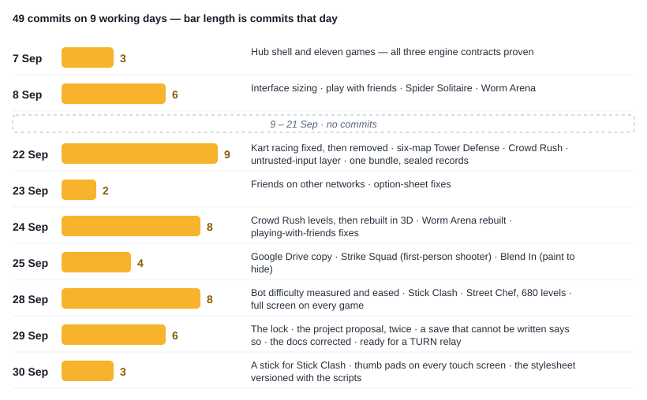

### Phase 4 — proposed

| Week | Dates | Work | Deliverable |
| --- | --- | --- | --- |
| 1–2 | 5–18 Oct | **Friends who connect** — an account on a relay provider's free plan, and its credentials in `relay-config.js`, where the code already expects them; the relay proved from two tabs with `?relay`; a room tested between mobile data and home broadband, both ways round; the failure sentence kept for when a relay is down | MS-1; O9 met |
| 3 | 19–25 Oct | **Small, overdue fixes** — the suite and the lock check on every push, with a red run stopping the deploy; the GameHub consent screen published so that any Google account can use Drive; Tetris renamed; a check that every key a game saves is in the backup. (A failed save made loud was here too; it shipped early, on 29 September.) | MS-2; O10 met |
| 4 | 26 Oct – 1 Nov | **An address of its own: the decision** — cost out staying, a GitHub organisation, a free host that sends headers, and a custom domain; how saves move across; no change to hosting yet | A written decision, signed off (MS-3) |
| 5 | 2–8 Nov | **The move**, if decided — response headers where the host allows, the new origin added to the OAuth client, the old address kept as a signpost, and the Drive copy as the bridge for saves | PlayVault on its own origin, or the decision to stay recorded |
| 6–7 | 9–22 Nov | **Game 17: a circuit racer** — Kart Racing's replacement, built on what phase 7 measured: sustained steering, a camera that turns with the car, grass that costs speed instead of stopping it, and rivals that stay on the road | MS-4 |
| 8–9 | 23 Nov – 6 Dec | **Sound, touch and contrast** — sound for the twelve silent games and one volume for the hub; every game played on a real touch screen (the pads already reach every touch screen, and Stick Clash has a stick, since 30 September); the light theme's brass darkened to `#9B630F` and every surface re-measured | MS-5; O16 met |
| 10 | 7–13 Dec | **Other browsers and real phones** — Firefox, Safari on macOS and iOS, and Chrome on a real Android phone: every game, the lock and the Drive copy in each | A browser matrix with no unverified row |
| 11 | 14–20 Dec | **Regression and security re-review** — the full suite, `lockcheck --net`, every old save shape, and a review of anything the relay or the move added | MS-6 |
| 12 | 21–27 Dec | **Release** — v1.0 tagged; README, SECURITY.md and GAMES.md refreshed; handover notes | MS-7; v1.0 |

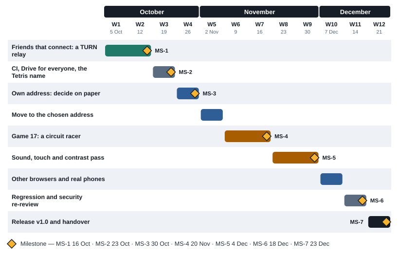

### Milestones

| ID | Milestone | Due | Gate |
| --- | --- | --- | --- |
| MS-1 | Friends connect from any network | 2026-10-16 | A match completes between mobile data and home broadband |
| MS-2 | Drive for everyone; tests on every push | 2026-10-23 | An account outside the test list signs in; a red test run stops a deploy |
| MS-3 | Address decided | 2026-10-30 | A written decision; no hosting change before this |
| MS-4 | Game 17 live | 2026-11-20 | Seventeen games, and the new folder touched nothing outside itself but the three lists that name a game |
| MS-5 | Sound, touch and contrast done | 2026-12-04 | AA on every primary surface in both themes |
| MS-6 | Regression and security green | 2026-12-18 | No open correctness finding; no unverified browser |
| MS-7 | v1.0 released | 2026-12-23 | Live, tagged and documented |

**MS-3 is a hard gate.** Moving to another origin strands every player's save on the old address unless they carry it across, so the move is decided on paper — with its migration — before anything changes. MS-4 is a gate of a different kind: game 17 must be built the way the other sixteen were, or the contract has failed, and that would be the finding.

## Testing and quality assurance

A game hub's worst failure is not a crash. It is a rule that is quietly wrong, a difficulty that is quietly unfair, or a save that quietly does not come back, and the test strategy is built around those three.

| Layer | Tool | Catches |
| --- | --- | --- |
| Engines and rules | `tools/smoke.js`, in Node | Wrong rules, illegal moves, runs that do not replay, deals that cannot be finished |
| Minified source | `tools/smoke.js --min` | Anything the minifier would change in the engines; a shipped bundle older than its sources |
| Playing with friends | Two rooms paired in memory, with a real `PV.boardNet` on each end | Routing, seat stamping, the host's accept rules, resync, resigning, an empty room |
| The Drive copy | A fake Google: a sign-in library that answers as Google's does, and a Drive behind `fetch()` that keeps files per account | Queries, the multipart upload, restore, sign-in failures, auto-save |
| Security | Hostile files, stored values and peers in Node; `tools/lockcheck.mjs` in a real headless Chrome | Script that runs, a hang, a console that reaches a save, a game the lock would undo |
| Balance | Bots playing whole matches, careers and tournaments | A difficulty no harder than the one below it; an economy that stalls |
| Look and feel | The built bundle in a browser, at a laptop's size and a phone's | Layout, overflow, the option sheets, end cards on a full screen |

### The run behind this proposal

On 30 September 2026, at commit `10ffeec`:

| Run | Result |
| --- | --- |
| `node tools/smoke.js` | 2,555,922 checks in 39 sections, 0 failures, about 23 s — three runs of this code that day, and a fourth by the independent reader |
| `node tools/smoke.js --min` | The same 2,555,922 checks against the source minified the way the build minifies it, 0 failures, the same four runs; the shipped bundle's hash matches its sources, and the stylesheet carries the same stamp |
| `node tools/smoke.js 2 --only chess` | Chess perft at depth 4: 197,281 positions, as published |
| `node tools/lockcheck.mjs --net` | 80 passed, 0 failed — every console paste and Elements-panel edit in the threat model, all sixteen games played on the shipped bundle under the lock with nothing of their own put back, Stick Clash's stick dragged on the page and on the whole screen, and its attack button held, by real touches on an emulated phone, with nothing put back, Export and Import through the real file input, Google's sign-in library loading under the lock, *To Drive* opening its window, two locked tabs opening, joining and starting a match over PeerJS, and a storage filled to the last character bringing up the saving strip under the lock. The same match forced through the relay was skipped, as it is until `relay-config.js` holds one |

The engines run in Node; the views and the shell run only in the browser, which is why the lock check plays every game on the shipped bundle.

### Checks that catch real bugs

The suite drives `apply()` and the ticker rather than the internals: driving a game's handler directly walks past the legality gate and tests a path no player ever takes, which is how a green headless run and a broken browser happen at the same time. Its exceptions are named in its own header — the chess and Chinese Chess searches use their engines' make and unmake, and a few tests set a position up by writing cells before playing on through `apply()`. Among its 2.56 million checks:

- **Chess perft** — 20, 400 and 8,902 positions from the opening on every run, and 197,281 at depth four in the longer run. If a pin, a check or any piece's movement is wrong, one of those numbers moves.
- **Chinese Chess opens with exactly 44 legal moves.**
- **Every Mahjong board is replayed clear**, and every clue a Sudoku removes is checked for a unique answer.
- **Runs replay.** All nine arcade games are run twice from the same seed and inputs, and must match to the tick.
- **Every Street Chef level is played** by the bot, every dish is checked makeable in its kitchen on every level, and every kitchen, fully upgraded, is laid out wide and tall with every tap landing where it should.
- **Frozen, the engines still play.** With the language frozen and `Math.random`, `JSON.stringify` and `Object.prototype` hooks all failing, every engine still runs.
- **A refused save is kept and reported.** With the storage refusing writes for quota, and then refusing everything, reads come from memory, progress keeps adding up, Export carries it, and the next write that lands saves it.
- **A relay entry that would fail in silence is dropped.** A bad entry would not fail loudly — the browser would simply never get a relay — so the suite hands `net.js` good entries, a lone address, wrong schemes, missing or spaced credentials, over-long values and too many entries, and checks what survives; and that asking for relay-only connections forces the relay only when there is one to force.

### Difficulty and balance, measured

Every difficulty change since 22 September was measured with a bot before anything was changed, and the suite now holds each result as a floor. One lesson from Tower Defense runs through all of them: **calibrate on the better player — a weak bot only measures itself.**

| Game | What was measured | Before | After |
| --- | --- | --- | --- |
| Tower Defense | Share of its gold a strong bot needs to clear normal · hard | 54% · 79% | 78% · 88% |
| Strike Squad | Seconds for one bot to kill a player standing in the open at 15 m, easy · normal | 1.38 · 1.13 | 6.2 · 2.9 |
| Strike Squad | Kills per death for a simulated casual player on normal | 1.02 | 1.49 |
| Crowd Rush | Levels of the first 30 the test bot clears | — | 27; levels 1–12 every time |
| Blend In | Hiders found out of six by easy · normal · hard seekers, against normal hiders | — | 0.3 · 1.7 · 2.8 |
| Stick Clash | Wins for the regular fighters | 3 to 31 of 42 | 32 to 45 of 84 |
| Street Chef | Tries for a simulated casual player to clear all 680 levels | Stuck at Sandwich Street | About 900 |

### Browser matrix

| Browser | How it was checked | Status |
| --- | --- | --- |
| Chrome on a desktop | `lockcheck.mjs` in headless Chrome; the built bundle played by hand | Verified |
| Edge | The same engine as Chrome, not run separately | Unverified — Phase 4, week 10 |
| Chrome at a phone's and a tablet's size | The built bundle at phone and tablet sizes, upright and on its side, with touch emulated: every thumb pad on the screen, and full screen through a real tap; on a tablet every Snake and Tetris button reached its game, and on a phone Stick Clash's stick walked, blocked and jumped | Verified — emulated |
| Firefox | The lock's reading of Firefox stacks tested in Node; the games not yet played | Unverified — Phase 4, week 10 |
| Safari on macOS and iOS | The lock's reading of Safari stacks tested in Node; WebGL, full screen and storage not yet checked | Unverified — Phase 4, week 10 |
| A real Android or iOS phone | Not yet | Unverified — Phase 4, week 10 |
| A browser whose stacks the lock cannot read | The lock stands down rather than refuse the game's own code | By design |

Safari needs the most care: it deletes a site's script-writable storage — `localStorage` included — after seven days of browsing without a visit, which is carried in the risk register.

### Two traps worth writing down

**A green Node run proves nothing about a view.** Views never run in Node; the Tetris view that died half-built, leaving its key handlers to throw in every later game, showed only in a browser — which is why `lockcheck.mjs` exists.

**Two tabs on one machine prove nothing about two networks.** They always find a direct route. Only a phone on mobile data and a laptop on home broadband test a room.

### Release checklist

- [ ] `node tools/smoke.js` green
- [ ] `node tools/build.js` run — after a stylesheet change too — and the bundle and `index.html` committed together
- [ ] `node tools/smoke.js --min` green, with the same number of checks
- [ ] `node tools/lockcheck.mjs` green; `--net` as well for any change near Drive or rooms
- [ ] No "put back" line in the console during normal play with `?guard` on
- [ ] A new saved store added to `BACKUP_STORES`, and to the sealed list if it holds anything earned
- [ ] No `localStorage` call outside `js/core/store.js` — a write around the store fails silently again
- [ ] Every new string present in English and 简体中文
- [ ] A new option sheet checked at a laptop's width and a phone's
- [ ] Contrast re-measured on any changed surface
- [ ] Pushed to `main`, and the live page's `?v=` stamp matching the build

## Risks and mitigations

The design trades a server for privacy, cost and simplicity, and most of the serious risks below are the bill for that trade. They are stated plainly rather than minimised, because a player who does not understand R1 will one day lose a month of Street Chef.

| ID | Risk | Likelihood | Impact | Mitigation | Residual |
| --- | --- | --- | --- | --- | --- |
| R1 | **The save has one copy, and the player's browser holds it.** Clearing browsing data deletes it | High over a year | High | Export; the Drive copy with *Auto*; a *Load from Drive* offer on an empty browser | Medium — every route needs the player to have acted once |
| R2 | **Safari deletes storage after seven days without a visit** | Medium | High | The Drive copy; week-10 verification; a note for iPhone players | Medium — not fixable from the page |
| R3 | **Friends on different networks often cannot connect** — there is no TURN relay yet: PeerJS's own no longer resolves, and every free relay now needs an account | High on mobile data | Medium | A plain sentence instead of a hang; the code ready for a relay since 29 Sep, with `?relay` to prove one; the account and a relay in weeks 1–2 | Open until MS-1, then Low |
| R4 | **Only test users can sign in to Drive** — the GameHub consent screen is in Testing | Certain today | Medium | Publish the consent screen in week 3; `drive.file` needs no review | Low after MS-2 |
| R5 | **One origin with every `kaonhew02.github.io` app** — a shared `localStorage`, a shared quota, and unlocked consoles next door | Medium | Medium | The seals still apply; an origin of its own decided at MS-3 | Medium until the move |
| R6 | **A save that fails to write** — on a full or blocked storage the progress lives only in the tab | Low | Medium | Since 29 Sep: read from memory, so progress keeps adding up; retried on the next write that lands; a strip over every screen offers Export. It used to be silent, and a full storage handed back the older value | Low |
| R7 | A new game's store is left out of `BACKUP_STORES` or the sealed list | Medium | High | The release checklist; per-game checks for Stick Clash, Street Chef and the puzzles | Medium — a generic check in week 3 makes it a class guarantee |
| R8 | The deployed bundle drifts from its source | Low | High | A hash of the sources in the bundle and on the lock's and the stylesheet's addresses, and the suite fails on a stale one; `--min` runs the engines' tests against minified source; the lock check plays the shipped bundle | Low — tests on every push in week 3 enforce it |
| R9 | **The Tetris name** — a trademark of The Tetris Company, which enforces it, free clones included | Medium | High | Rename in week 3, and keep the look PlayVault's own | Low after the rename |
| R10 | A game challenged as a copy of its commercial reference | Low | High | None of any reference's art, names, characters or code; only the mechanics its store page describes; each game's phase in `docs/GAMES.md` records what was taken and what was drawn | Low |
| R11 | A patched client claims a race score | Medium among programmer friends | Low | Rooms are six digits read aloud to people you know; no global board to poison | Accepted |
| R12 | PeerJS's free public broker slows down or disappears | Medium | Medium — friends only | Everything else works without it; PeerJS's server is open source and could be self-hosted | Medium |
| R13 | Google's sign-in script, which cannot be pinned, runs with full reach into the page | Low | High | Loaded only when Drive is about to be used; the page's policy names the exact file | Medium — a trust extended to Google |
| R14 | Relay credentials are readable in the page, so anybody could spend the free quota | Medium | Low | A match moves a few hundred kilobytes at most; the quota is watched and the credentials rotated if abused | Low |
| R15 | One developer: 45,000 lines in one head | Medium | High | `docs/GAMES.md` — 1,641 lines recording every phase's request, measurement and decision — plus the README and SECURITY.md | Medium |
| R16 | A new game needs an exception — a library, a server, a CDN | Medium | Medium | No dependencies is a standing rule; the WebGL decision shows what keeping it costs | Low |

### The three that deserve a decision, not just a mitigation

**R1 and R2 are the same risk.** Both end with a browser that no longer holds the save, and the only real answer is a copy that is not in the browser: the Drive copy. Today it is off by default and open only to test users. Phase 4 opens it to everybody at MS-2, and the hub should ask once — after a player's first real progress — for the first push, rather than waiting to be found in Settings.

**R3 is the difference between "play with friends" and "play with friends on the same Wi-Fi".** Everything above the network is built and tested, and since 29 September so is everything for the relay but the relay: the file its credentials go in, the checks on them, and `?relay` to prove it. What is missing is an account at a relay provider. It is Phase 4's first item because it is the cheapest fix with the largest effect.

**R5 is an architecture decision, not a bug.** An origin is where a browser draws its walls, and PlayVault shares its walls with every other app on the account. Moving is cheap; moving without stranding players' saves is the part that needs a plan, which is why MS-3 is a written decision before any change.

## Resources and budget

PlayVault costs RM 0 a month to run today, and Phase 4 keeps it there unless the address decision chooses a custom domain or week 10 needs rented devices. The only real resource is the developer's time.

### People

| Role | Who | Commitment |
| --- | --- | --- |
| Developer, designer and tester | One person | About 10 hours a week for 12 weeks — **120 hours** |
| Product owner and reviewer | The same person, acting as a player | Continuous — the hub is played while it is built |
| Playtesters | Friends, including the programmer who found the console cheat | Informal — a room is the test bench for weeks 1–2 and 10 |

A second developer is not proposed. `docs/GAMES.md` records every phase's request, measurement and decision, which is what a handover would run on, and Phase 4 is not large enough to justify splitting a single-author codebase.

### Tools and infrastructure

| Item | Cost | Note |
| --- | --- | --- |
| GitHub repository and Pages hosting | RM 0 | Free for public repositories |
| GitHub Actions, for tests on every push | RM 0 | Free for public repositories |
| Storage | RM 0 | The player's own browser; a save is a few kilobytes |
| PeerJS public broker; Google and Cloudflare STUN | RM 0 | Free, with no account |
| TURN relay | RM 0 | A relay provider's free plan, which now needs an account but no card — Metered's (500 MB a month, with TURN over TLS on port 443) or ExpressTURN's (1,000 GB a month, TLS paid); chosen and checked against its quota at MS-1 |
| Google Cloud project and Drive API | RM 0 | The shared GameHub client; free at this volume |
| Google Drive space | RM 0 | The player's own; a backup is a few kilobytes |
| Node.js, Chrome and an editor | RM 0 | Development only; nothing ships |
| **Current total** | **RM 0 / month** |  |

### Optional and conditional costs

| Item | Cost | When it applies |
| --- | --- | --- |
| A free host of its own — a GitHub organisation, or a host that sends headers | RM 0 | If MS-3 chooses an origin of its own without a custom domain |
| Custom domain | About RM 60 / year | Only if MS-3 chooses a memorable address |
| Cloud device testing | About US$30–40 (≈ RM 130–170) for one month | Only if a real iPhone and Mac cannot be borrowed for week 10 |
| A paid relay plan | Priced at MS-1 | Only if a free plan's quota proves too small; not assumed |

*Ringgit figures are approximate, converted at about RM 4.25 to the US dollar; they are for sizing, not for budgeting to the sen.*

### Three-year total cost of ownership

| Scenario | Year 1 | Years 2–3 | 3-year total |
| --- | --- | --- | --- |
| **Stay as is** | RM 0 | RM 0 | **RM 0** |
| An origin of its own on a free host | RM 0 | RM 0 | **RM 0** |
| An origin of its own with a custom domain | RM 60 | RM 120 | **RM 180** |
| The same, plus one month of cloud device testing | About RM 230 | RM 120 | **About RM 350** |

The recommendation carried into MS-3 is an origin of its own on a free host that can send response headers — Cloudflare Pages is one — which closes R5 and the three missing headers at RM 0, with a custom domain only if a memorable address is wanted.

### What the budget does not buy

No analytics, no error-reporting service, no advertising network, no game-engine licence, no asset store, no paid fonts and no server. Everything in the stack is free at this scale because the hub is built to stay small enough to be.

## Future roadmap

After v1.0 the work splits three ways: things worth building, things deliberately not built, and the sibling apps PlayVault shares code with.

### Candidates for v1.1 and beyond

| Item | Value | Cost |
| --- | --- | --- |
| **Install as an app (PWA)** | Starts with no network, a home-screen icon, no app store | Low to medium — a manifest and a service worker, with its own stale-cache trap that the hash stamp helps with |
| A daily challenge | The same seed for everybody each day, and a reason to come back | Low — the engines are already pure functions of their seed, and the date gives the seed, as Strike Squad's missions do |
| Achievements across the hub | Goals that span games; CardVerse already has them | Medium — one more sealed store |
| An honest leaderboard | Scores worth comparing with strangers | High — a server that re-runs each claimed run from its seed and inputs, which the engines' determinism makes possible |
| Online matches for the shooters | Strike Squad and Blend In against people, not bots | High — state at 60 Hz needs a server |
| More games per family | Go (围棋), Minesweeper, Klondike back | Low each — the contracts exist for exactly this |
| What the references have and PlayVault does not | Worm Arena's seasonal modes; Crowd Rush's gems and bonus levels; Strike Squad's lucky wheel | Low to medium each; listed under *Not built* in each game's phase |

### Deliberately not built, and why

These have each been considered and declined. The reasons are recorded so they are not proposed again as new:

- **Adverts, or anything bought with money.** The hub exists to be the alternative to both.
- **"Continue after dying" for an advert**, which one reference sells. A lost run is lost; that is what makes a run worth something.
- **A leaderboard without a server.** A score from a browser is a claim, however the client was written.
- **Hiding the source.** It cannot be done. The only lever that moves is a private repository, and the bundle stays downloadable even then.
- **Kart Racing and Klondike**, both removed on request. The circuit racer replaces the first.

### The sibling apps

| App | What it is | What it shares with PlayVault |
| --- | --- | --- |
| **CardVerse** | A card and tile game hub | `net.js`, `i18n.js` and `drive.js` were ported from it, and it shares the GameHub Drive client; its `drive.js` is the canonical copy, and four of PlayVault's fixes are owed back to it |
| **GameTable** | A tabletop game hub — *One Table. Many Stories.* | The same shape: vanilla JavaScript in one namespace, nothing to install, a headless smoke suite |
| **MiniShoppingMall** | An idle mall tycoon | The same shape, and a sealed save of the same kind |
| **MoneyFlow, FinSim, PlanSphere** | Money and travel apps | The Settings data row — the same pills, icons and order |

## Conclusion and approval

PlayVault already works. Sixteen games are live and playable alone or with friends, in two languages, at RM 0 a month; 2,555,922 checks pass on the source and on its minified form, and a real Chrome plays all sixteen games on the bundle that ships; since 29 September a friend with the developer tools open can no longer reach a save, and a save the storage refuses is no longer lost in silence; and since 30 September a tablet, or a phone on its side, has its controls. What this proposal asks for is not a build from nothing. It is twelve weeks to close the gap between a hub that works for its developer and for friends on the same Wi-Fi, and one that works for anybody, anywhere, for years.

The case rests on three things:

1. **The architecture is paid for.** Three contracts and two harnesses carried sixteen games without the shell ever naming one, and engines that never touch the page or `Math.random()` gave replays, races and a 2.56-million-check suite for free. That was the expensive part, and it is done.
2. **The remaining scope is small and known.** A relay is one account — the code is already waiting for its credentials — and two weeks of testing; the consent screen, tests on every push and the rename are a week between them — and the loud save failure planned beside them is already done. The one open question — an address of its own — is decided on paper at MS-3 before anything moves.
3. **The downside is bounded.** If MS-3 decides to stay where it is, and even if the circuit racer slips, Phase 4 still delivers friends who connect from any network, a Drive copy open to everybody, sound, touch, contrast and a verified browser matrix — at RM 0.

### The decision requested

|  |  |
| --- | --- |
| **Approve** | Phase 4 as scoped — 12 weeks, about 120 hours, one developer |
| **Budget** | RM 0 committed now; any spend gated behind MS-3 and week 10, and capped at about RM 230 in the first year |
| **Decide by** | 2026-10-02 |
| **Start** | 2026-10-05 |

If Phase 4 is not approved, the recommendation is to do weeks 1 and 3 anyway, above all the relay and the published consent screen. They are a few days' work between them, and they are the difference between "play with friends" and "play with friends at home", and between a save with one copy and a save with two.

### Sign-off

| Role | Name | Decision | Date |
| --- | --- | --- | --- |
| Product owner |  |  |  |
| Developer |  |  |  |
| Reviewer |  |  |  |

### Sources

Every figure in this proposal is taken from the PlayVault repository as it stands on 30 September 2026 (commit `10ffeec`; revision 2 described `da85e98`, and revision 1 `dec459c`) — `README.md`, `SECURITY.md` and `docs/GAMES.md`, the source under `js/`, `css/` and `tools/`, and 49 commits of history from 7 to 30 September 2026 — and from runs made that day: the smoke suite on the source and on minified source, a longer chess run, the lock check with its network tests in headless Chrome, and a check of the live page's version stamp. Contrast was computed from the stylesheet's colour tokens for revision 1; no commit since has changed one, and the one added since — `--bad-soft`, behind the saving strip — was measured for this revision. The claims were checked against the source a second time by an independent reader, and what it found wrong or overstated was corrected. The screenshots were captured from the built bundle in headless Chrome with a throwaway profile; the level-13 player in them is test data. The comparisons in [Background and problem statement](#background-and-problem-statement) are stated from general knowledge, and the trademark points in [Risks and mitigations](#risks-and-mitigations) are not legal advice; both should be checked before this document is shown outside the project.

## Glossary

| Term | Meaning |
| --- | --- |
| **Family** | Board, puzzle or arcade — the group a game belongs to, chosen by how it uses time |
| **Contract** | What an engine must promise to belong to a family: `board.js`, `puzzle.js` or `loop.js` |
| **Harness** | The shared code that hosts the board games and the real-time games: canvas, resizing, full screen, pause, undo, the thumb pad and the end card |
| **Thumb pad** | The on-screen buttons a touch screen gets in place of keys; Stick Clash's adds a stick |
| **Engine** | A game's rules, with no access to the page, the profile or `Math.random()` |
| **Seed** | The number a deal, a map or a match is worked out from; the same seed gives the same game |
| **Tick** | One step of a real-time game's fixed 60 Hz clock; input is applied only on a tick |
| **Replay** | Running a game again from its seed and inputs to get the identical result |
| **Host authority** | The board-game rule that the host alone checks and accepts moves |
| **Race** | Friends playing their own copies of one seeded game, ranked by the host at the end |
| **Room code** | The six digits one player reads out so that the others can join |
| **WebRTC** | The browser's built-in way to connect two browsers directly |
| **PeerJS broker** | A free public service that introduces two browsers to each other; it never sees the game |
| **STUN · TURN** | STUN tells a browser its public address; TURN relays the traffic when no direct route exists |
| **CGNAT** | Carrier-grade NAT — how most mobile networks share addresses, and why a relay is needed |
| **Seal** | A checksum stored with a record or a backup, so that a hand edit is noticed |
| **The lock** | `js/core/guard.js`, which keeps the console and the Elements panel from changing the page or its saves |
| **CSP** | Content-Security-Policy — a rule in the page that tells the browser what it may load and run |
| **SRI** | Subresource Integrity — a hash that makes the browser refuse a changed third-party file |
| **Origin** | Scheme, host and port — the unit a browser uses to keep one site's storage apart from another's |
| **`drive.file`** | The narrowest Google Drive permission: only files the app itself created |
| **GameHub** | The Google OAuth client and Drive folder shared by PlayVault and CardVerse |
| **Bundle** | `js/playvault.min.js` — the 124 source files, stripped into one |
| **`?v=` stamp** | The hash on the addresses of the bundle, the lock and the stylesheet that makes a browser fetch a new version |
| **Perft** | A count of every position reachable to a given depth — the standard test of a chess move generator |
| **7-bag · SRS** | A shuffled bag of the seven falling pieces, and the standard rotation and wall-kick system |
| **A\*** | The path-finding search Strike Squad's bots use over one-metre cells |
| **Instanced drawing** | Drawing many copies of one shape in a single WebGL call — how Crowd Rush draws its crowds |
| **Texel** | One cell of a texture; Blend In samples its surfaces onto texels so that bots and players see the same colours |
| **XP and level** | Experience from every game; passing level *L* takes 100 + 50 × (*L* − 1) XP |
| **WCAG AA** | The accessibility contrast standard: 4.5:1 for normal text |
